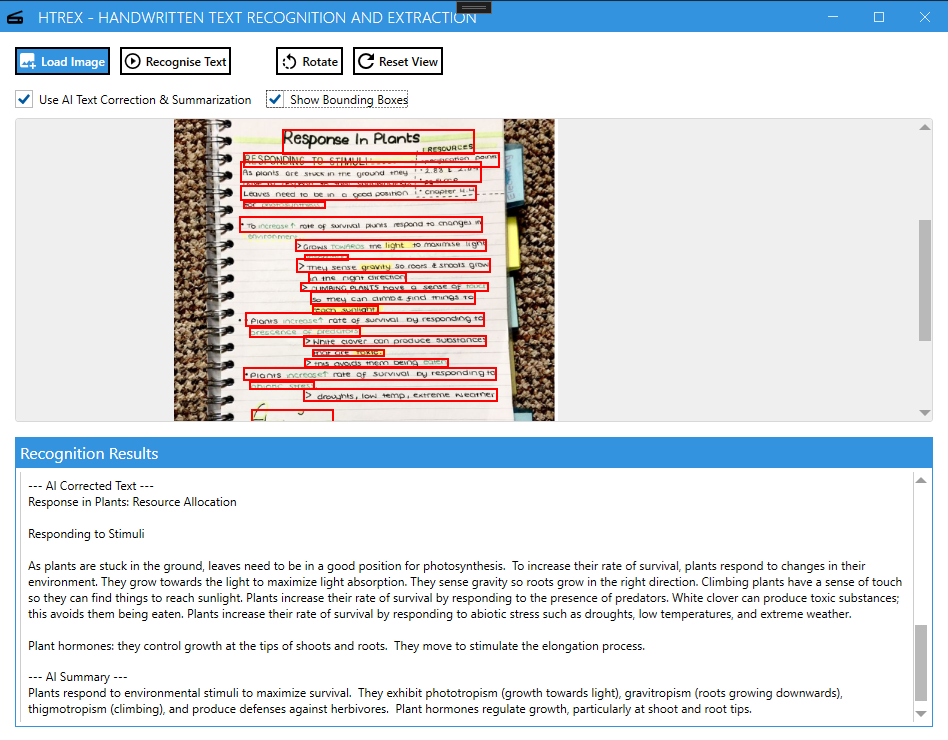

# HTRex – End-to-End Handwritten Text Recognition

HTRex is a desktop application that performs end-to-end handwritten text recognition (HTR). It combines text detection, recognition, and intelligent text processing into a streamlined tool for extracting handwritten text from scanned documents, notes, or images.

This project was built as part of my final year project, where it achieved a **7.74% Character Error Rate (CER)** on benchmark handwritten datasets which beat out competition such as Tesseract-OCR and Google Cloud Vision.

---

## Features

* **End-to-End Pipeline**

  * Text detection with [PaddleOCR]
  * Text recognition with [TrOCR (Transformer-based OCR)]
  * Post-processing with Google Gemini API for error correction and line merging

* **Cross-Platform Desktop App**

  * Simple, user-friendly GUI built for non-technical users
  * Support for image uploads (JPG, PNG)
  * Export results to text file or clipboard

* **High Accuracy**

  * Achieved 7.74% CER on testing datasets
  * Works with messy handwriting, variable spacing, and different writing styles

---

## Tech Stack

* **Languages & Frameworks**: Python, C# (UI), Flask API (backend service)
* **AI/ML Models**: PaddleOCR, TrOCR (Hugging Face Transformers), Google Gemini API
* **Other Tools**: NumPy, Pandas, OpenCV

---

## Project Structure

```
HTRex/
│
├── HTRex_UI/         # Desktop application UI
├── ocr_service/      # Flask API handling OCR requests
├── merge_lines/      # Text post-processing logic
├── requirements.txt  # Dependencies
└── README.md         # Project documentation
```

---

## Installation

1. **Clone the repository**

   ```bash
   git clone https://github.com/yourusername/HTRex.git
   cd HTRex
   ```

2. **Set up virtual environment (recommended)**

   ```bash
   python -m venv venv
   source venv/bin/activate   # Mac/Linux
   venv\Scripts\activate      # Windows
   ```

3. **Install dependencies**

   ```bash
   pip install -r requirements.txt
   ```

4. **Run the application**

   ```bash
   python HTRex_UI/main.py
   ```

---

## Usage

1. Launch the application.
2. Upload an image of handwritten text.
3. The app will:

   * Detect text regions (PaddleOCR)
   * Recognize characters (TrOCR)
   * Post-process lines (Gemini API)
4. Copy or export the recognized text.

---

## Results

* **Character Error Rate (CER)**: 7.74%
* Tested on diverse handwritten datasets (IAM), including messy and non-standard writing styles.
* Demonstrated robustness across different resolutions and input formats.

---

## Screenshots




## Future Improvements

* Add support for batch document processing
* Extend language coverage beyond English
* Integrate with cloud storage (Google Drive, OneDrive)
* Improve UI with modern frameworks (Electron, Next.js desktop wrapper)

---

## License

MIT License – feel free to use, modify, and distribute with attribution.

---

## Author

**DSRCF**

